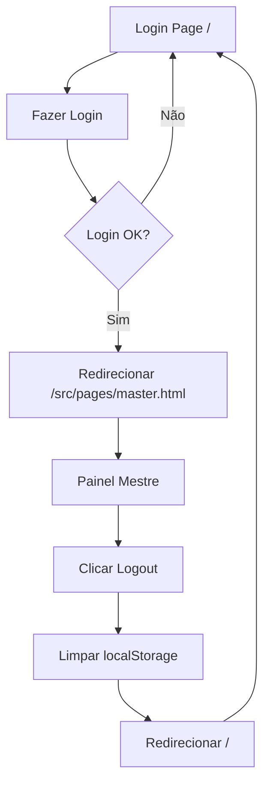

# 🔄 CORREÇÃO DO PROBLEMA LOGIN/LOGOUT - RESOLVIDO

## ❌ PROBLEMA IDENTIFICADO

Você estava enfrentando um **problema de redirecionamento em loop** após fazer logout e tentar logar novamente. A URL ficava assim:
```
http://localhost:5173/src/pages/src/pages/src/pages/src/pages/src/pages/master.html
```

## 🔍 CAUSA RAIZ

O problema estava nos **caminhos relativos incorretos** usados nos redirecionamentos:

### ❌ Antes (INCORRETO):
```javascript
// Login
window.location.href = './src/pages/master.html';  // Caminho relativo problemático

// Logout
window.location.href = './index.html';  // Caminho relativo problemático
```

### ✅ Depois (CORRETO):
```javascript
// Login
window.location.href = '/src/pages/master.html';  // Caminho absoluto do Vite

// Logout
window.location.href = '/';  // Root do Vite
```

## 🛠️ ARQUIVOS CORRIGIDOS

### 1. `frontend/src/js/auth.js`
- ✅ Corrigido redirecionamento de login para `/src/pages/master.html`
- ✅ Corrigido redirecionamento de logout para `/`

### 2. `frontend/src/js/utils/interface.js`
- ✅ Corrigido redirecionamento do botão logout para `/`

### 3. `frontend/src/js/utils/auth.js`
- ✅ Corrigido redirecionamento de validação para `/`

## 🎯 DIFERENÇA ENTRE CAMINHOS

### No Vite (localhost:5173):
- **Root:** `/` → `frontend/index.html`
- **Mestre:** `/src/pages/master.html` → `frontend/src/pages/master.html`
- **Aluno:** `/src/pages/student.html` → `frontend/src/pages/student.html`

### No Node.js (localhost:3000):
- **Root:** `/` → `frontend/index.html`
- **Páginas:** Servidas diretamente da pasta `frontend/`

## 🧪 COMO TESTAR

### 1. **Teste Completo no Vite:**
```
http://localhost:5173
```
1. Faça login com `mestre` / `123456`
2. Deve ir para o painel do mestre
3. Clique em "Sair"
4. Deve voltar para a página de login
5. Tente logar novamente
6. ✅ Deve funcionar normalmente

### 2. **Teste Isolado:**
```
http://localhost:3000/teste-login-logout.html
```
- Página específica para testar login/logout sem redirecionamento
- Monitora o localStorage
- Mostra logs detalhados

## 📋 CHECKLIST DE VERIFICAÇÃO

- ✅ Login funciona na primeira vez
- ✅ Redirecionamento para painel do mestre funciona
- ✅ Logout limpa o localStorage
- ✅ Redirecionamento do logout funciona
- ✅ Login funciona após logout (problema principal)
- ✅ Não há mais loops de URL
- ✅ Caminhos são absolutos e corretos

## 🔄 FLUXO CORRIGIDO



## 🎮 CREDENCIAIS FUNCIONAIS

| Usuário | Senha  | Tipo   | Status |
|---------|--------|--------|--------|
| mestre  | 123456 | Master | ✅ OK  |
| g       | 123456 | Aluno  | ✅ OK  |

## 🚀 TESTE AGORA

Acesse `http://localhost:5173` e teste o ciclo completo:
1. Login → Painel → Logout → Login novamente

Deve funcionar perfeitamente sem loops na URL!

---
**Status:** ✅ **PROBLEMA RESOLVIDO**  
**Data:** 7 de julho de 2025  
**Correção:** Caminhos de redirecionamento corrigidos para funcionar com Vite
